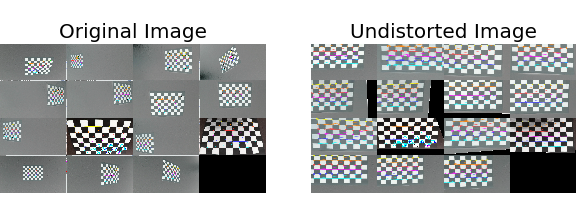

# Project 4--Advanced Lane Finding

# *Rubic Points*
## The goals / steps of this project are the following:
* Compute the camera calibration matrix and distortion coefficients given a set of chessboard images.
* Apply a distortion correction to raw images.
* Use color transforms, gradients, etc., to create a thresholded binary image.
* Apply a perspective transform to rectify binary image ("birds-eye view").
* Detect lane pixels and fit to find the lane boundary.
* Determine the curvature of the lane and vehicle position with respect to center.
* Warp the detected lane boundaries back onto the original image.
* Output visual display of the lane boundaries and numerical estimation of lane curvature and vehicle position.

## Camera Calibration
Camera calibration was performed using the python script [*CameraCalibration.py*](./CameraCalibration.py). The routine performed the following:
1. Read a chessboard image.
2. Convert the image from color to gray scale.
3. Identify the chessboard corner locations using the OpenCV routine findChessboardCorners.
4. Further refine the estimate of the corner location using the OpenCV routine cornerSubPix.
5. Append the corner locations to a list
6. Repeat steps 1-5 until all the chessboard images have been processed.
7. The camera calibartion matrix and distortion coefficients are then estimated using the OpenCV routine cv2.calibrateCamera.
8. The accuracy of the calculated camera calibration is then estimated by reprojecting the coner points onto the chessboard.
9. Finally the calibration matrix and distoriton coefficients are saved to a pickle file.
A totaly of twenty chessboard images were provided to the camera calibration.  Of those twenty files, five were rejected for processing due to incompatatible image sizes.  The final estimated camera calibration values were:

Camera matrix is

| | | |
| :---: | :---: | :---: |
| 1158.7734939444706 |    0.0 | 669.6411388407582 |
|    0.0 | 1154.0749356989813 | 388.0784814554919 |
|    0.0 |    0.0 |   1.0 |


Lens distortion coefficients are

| Coefficient | Value |
| :---: | :---: |
| r1 |-0.2567800687154464 |
| r2 | 0.04339333102260943 |
| r3 |-0.1150366506303131 |
| t1 |-0.0006876303026921493 |
| t1 | 0.00012574538927438055 |

Reprojection estimates are

|  |  |
| :---: | :---: |
| Mean | 0.77856300011631 |
| Standard Deviation | 0.2915895232436049 |

A montage of the original chessboard images and their images after undistortion is show in Figure 1.

Figure 1: Montage of original and undistorted chessboard images.

The physical size of the chessboard squares was not provided for this exercise.  Hence the estimated focal lengths are not the actual focal length but are only relative to the assumed chessboard size of 1 unit by 1 unit.

## Pipeline (single images)

### 1. Provide an example of a distortion-corrected image.

To demonstrate this step, I will describe how I apply the distortion correction to one of the test images like this one:
![alt text][image2]

### 2. Describe how (and identify where in your code) you used color transforms, gradients or other methods to create a thresholded binary image.  Provide an example of a binary image result.

I used a combination of color and gradient thresholds to generate a binary image (thresholding steps at lines # through # in `another_file.py`).  Here's an example of my output for this step.  (note: this is not actually from one of the test images)

![alt text][image3]

### 3. Describe how (and identify where in your code) you performed a perspective transform and provide an example of a transformed image.

The code for my perspective transform includes a function called `warper()`, which appears in lines 1 through 8 in the file `example.py` (output_images/examples/example.py) (or, for example, in the 3rd code cell of the IPython notebook).  The `warper()` function takes as inputs an image (`img`), as well as source (`src`) and destination (`dst`) points.  I chose the hardcode the source and destination points in the following manner:

```python
src = np.float32(
    [[(img_size[0] / 2) - 55, img_size[1] / 2 + 100],
    [((img_size[0] / 6) - 10), img_size[1]],
    [(img_size[0] * 5 / 6) + 60, img_size[1]],
    [(img_size[0] / 2 + 55), img_size[1] / 2 + 100]])
dst = np.float32(
    [[(img_size[0] / 4), 0],
    [(img_size[0] / 4), img_size[1]],
    [(img_size[0] * 3 / 4), img_size[1]],
    [(img_size[0] * 3 / 4), 0]])
```

This resulted in the following source and destination points:

| Source        | Destination   | 
|:-------------:|:-------------:| 
| 585, 460      | 320, 0        | 
| 203, 720      | 320, 720      |
| 1127, 720     | 960, 720      |
| 695, 460      | 960, 0        |

I verified that my perspective transform was working as expected by drawing the `src` and `dst` points onto a test image and its warped counterpart to verify that the lines appear parallel in the warped image.

![alt text][image4]

### 4. Describe how (and identify where in your code) you identified lane-line pixels and fit their positions with a polynomial?

Then I did some other stuff and fit my lane lines with a 2nd order polynomial kinda like this:

![alt text][image5]

### 5. Describe how (and identify where in your code) you calculated the radius of curvature of the lane and the position of the vehicle with respect to center.

I did this in lines # through # in my code in `my_other_file.py`

### 6. Provide an example image of your result plotted back down onto the road such that the lane area is identified clearly.

I implemented this step in lines # through # in my code in `yet_another_file.py` in the function `map_lane()`.  Here is an example of my result on a test image:

![alt text][image6]

---

## Pipeline (video)

### 1. Provide a link to your final video output.  Your pipeline should perform reasonably well on the entire project video (wobbly lines are ok but no catastrophic failures that would cause the car to drive off the road!).

Here's a [link to my video result](./project_video.mp4)

---

## Discussion

### 1. Briefly discuss any problems / issues you faced in your implementation of this project.  Where will your pipeline likely fail?  What could you do to make it more robust?

Here I'll talk about the approach I took, what techniques I used, what worked and why, where the pipeline might fail and how I might improve it if I were going to pursue this project further.  
